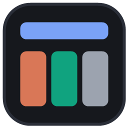

# VibeDeck

A terminal cockpit for vibe coders. One prompt bar on top, up to four live AI CLI panes below — type once, every model answers at the same time, and each pane stays a fully interactive terminal so you can answer each CLI's questions and permission prompts yourself.



## What it does

- **Broadcast**: type in the top bar, hit Enter, and the prompt is typed into every pane (Claude Code, Codex, Grok — any terminal AI CLI).
- **Panes are real terminals**: xterm.js + a real PTY per pane. Click in and type like normal.
- **1–4 panes**, any mix — including the same CLI more than once (three Claudes, why not).
- **Model / effort dropdowns** per pane: Claude switches in-session via `/model` and `/effort`; Codex and Grok relaunch with `-m` flags (their CLIs can't switch mid-session).
- **Compare**: see each model's answer to the last broadcast side by side, crown a winner, and keep a running tally.
- **Judge**: a headless `claude -p` call rules on the round — winner, what each answer missed, and a merged best take.
- **Relay**: pipe one pane's answer into another pane as its next prompt. Claude plans, Codex builds, Grok reviews.
- **History**: every broadcast is saved; ↑/↓ cycles, the history overlay reloads or deletes entries.
- **Playbooks**: starter prompts as plain markdown files in `playbooks/` — one click inserts them.

## Run it

```
npm install
node server.js
```

Then open http://localhost:18801 (or use `VibeDeck.bat`, which starts the server and opens a chromeless Edge app window).

Configure which CLIs are available in the `ROSTER` array at the top of `server.js`.

## Notes

- Windows-first: PTYs via `@lydell/node-pty` (prebuilt binaries, no compile), spawned through `cmd.exe`.
- Broadcasts queue until each pane's input UI has actually painted — fresh CLIs silently eat text sent during startup.
- Claude Code's folder-trust dialog is auto-cleared so it can't swallow your first prompt.

Built with Claude Code.
