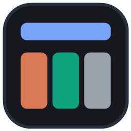

# VibeDeck

A terminal cockpit for vibe coders. One prompt bar on top, up to five live panes below — type once, every model answers at the same time. Compare the answers, let an AI judge pick a winner, or chain the models so one plans, one builds, one reviews.

Each pane stays a fully interactive terminal, so you can click in and talk to any CLI directly whenever you want.



## The idea

Stop treating AI assistants like a single employee. Run Claude Code, Codex, and Grok side by side, give them all the same assignment, and promote the best answer. VibeDeck is the workbench that makes that a two-keystroke habit instead of a tab-switching chore.

## What it does

- **Broadcast**: type in the top bar, hit Enter, and the prompt lands in every pane marked `bcast`. Shift+Enter writes multi-line prompts. Pane dots pulse while each model is still answering; when the last one finishes you get an "all answers in" nudge and the compare button lights up.
- **Compare**: every model's answer to the last broadcast, side by side. Crown a winner and keep a running tally.
- **Judge**: a headless `claude -p` call rules on the round — winner, what each answer missed, and a merged best take.
- **Relay**: pipe one pane's answer into another pane as its next prompt. Claude plans, Codex builds, Grok reviews.
- **Pipelines**: relay chains that run hands-free. Type a prompt, pick a chain, and the server sequences it — each step's answer feeds the next pane, with a status chip and cancel. Chains are plain JSON in `pipelines/` (`{prompt}` = your prompt, `{output}` = the previous step's answer); two ship by default: plan → build → review and answer → critique → revise.
- **Notes**: a PTY-less NOTES pane with an autosaving scratch pad. Hit **→ notes** on any AI pane and a headless Claude rewrites that pane's last answer as a plain-English note card — every detail kept, zero jargon.
- **Panes are real terminals**: xterm.js + a real PTY per pane, running the actual CLIs — not API wrappers. 1–5 panes, any mix, including the same CLI more than once (three Claudes, why not).
- **Project folder switcher**: pick the folder every pane runs in from the header — recents remembered, every pane relaunches there.
- **Model / effort dropdowns** per pane: Claude switches in-session via `/model` and `/effort`; Codex and Grok relaunch with flags (their CLIs can't switch mid-session). **Update models** refreshes the lists from the CLIs themselves (Grok via `grok models`, Claude/Codex by scraping their `/model` menus) and jumps every pane to the newest model — new releases show up without touching code.
- **Yolo by default**: every pane launches with its CLI's skip-permissions flag (claude `--dangerously-skip-permissions`, codex `--dangerously-bypass-approvals-and-sandbox`, grok `--always-approve`) so approval prompts never interrupt a broadcast. Each pane has a `yolo` toggle to turn prompts back on.
- **Images**: drag an image onto a pane or paste one (Ctrl+V) while it's focused — VibeDeck saves it to `data/images/` and types the file path into that CLI's input, ready to submit.
- **Token meter**: a sidebar (meter button in the header) showing today's usage and API-rate cost across all three CLIs — Claude per-model from `~/.claude` transcripts (cache read/write included), Codex totals + % of your plan window from its rollout logs, Grok estimated (it logs no token counts). Rates live at the top of `meter-data.js`.
- **History**: every broadcast is saved; ↑/↓ cycles it in the bar, and the history overlay searches, reloads, or deletes entries. Repeats of the same prompt are stored once.
- **Playbooks**: starter prompts as plain markdown files in `playbooks/` — one click inserts them.

## Run it

```
git clone https://github.com/7LayerLabs/vibedeck
cd vibedeck
npm install
npm start
```

Then open http://localhost:18801.

- **Windows**: `VibeDeck.bat` starts the server and opens a chromeless Edge app window.
- **macOS**: double-click `VibeDeck.command` (first run: right-click > Open), and see `MAC-SETUP.md`. The Mac path is wired up but less battle-tested than Windows — issues welcome.

You'll need the CLIs you want panes for, installed and logged in — e.g. `npm i -g @anthropic-ai/claude-code @openai/codex`. Panes for tools you don't have simply fail to launch; SHELL and NOTES always work. Configure the roster in the `ROSTER` array at the top of `server.js`.

## Good to know

- **Local only, on purpose.** The server binds to `127.0.0.1` — nothing on your network can reach it. Worth being deliberate about, because yolo mode means the CLIs can act without asking.
- Cross-platform PTYs via `@lydell/node-pty` (prebuilt binaries, no compile) — `cmd.exe` on Windows, your login shell on macOS/Linux, so Homebrew/nvm paths just work. The shell pane is PowerShell on Windows, zsh (or `$SHELL`) elsewhere.
- Broadcasts queue until each pane's input UI has actually painted — fresh CLIs silently eat text sent during startup. Claude Code's folder-trust dialog is auto-cleared so it can't swallow your first prompt.
- Terminal output is coalesced per pane before it hits the websocket, so a deck full of repainting TUIs stays smooth.
- The landing page lives in `site/` — a single static file, deployable to Vercel/Netlify as-is.
- Press the keyboard icon in the header for all shortcuts.

Built with Claude Code.
